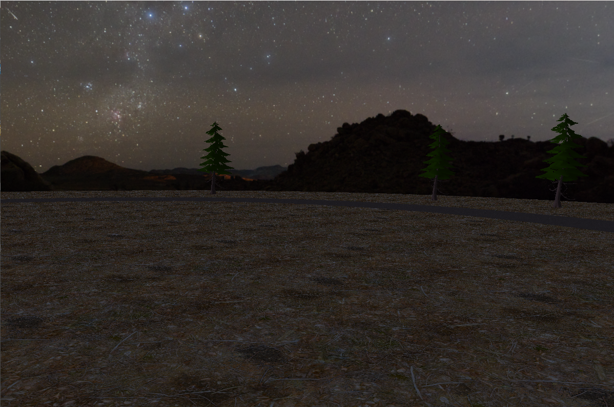
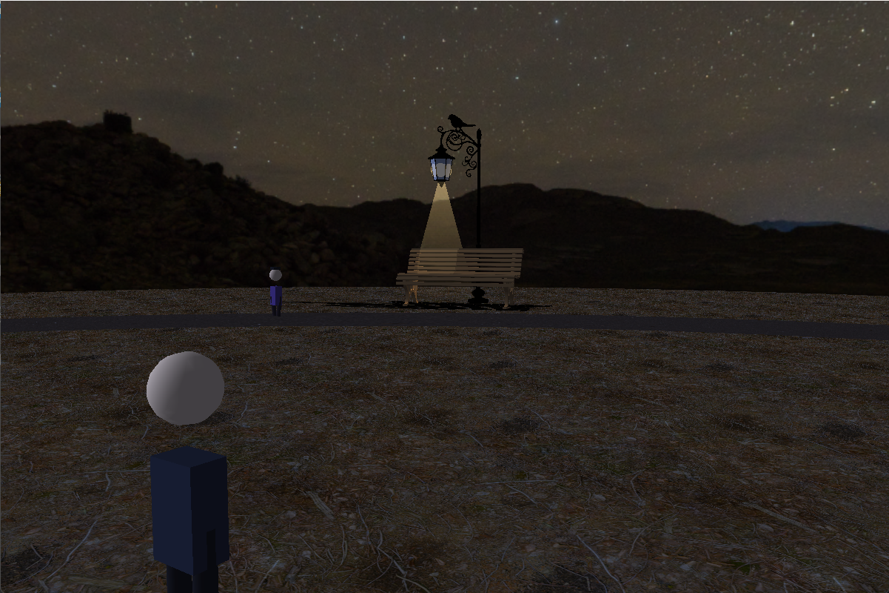
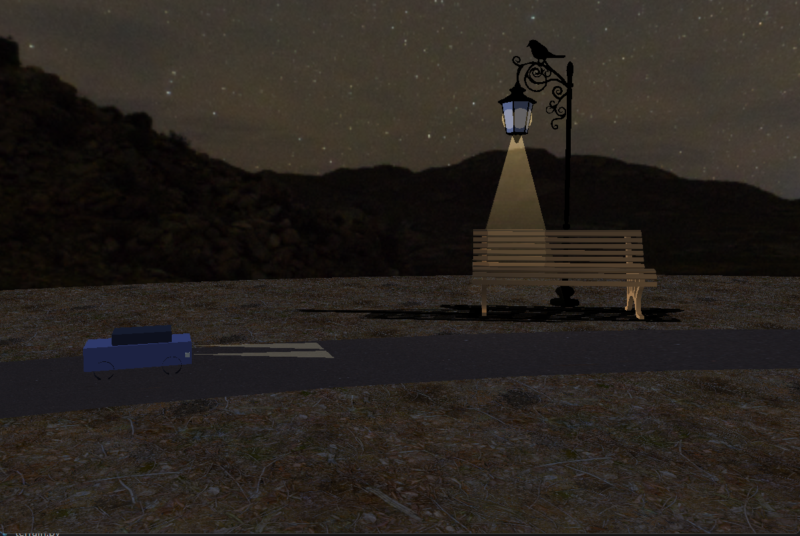

# Night Scene – Real-Time 3D OpenGL Environment

A real-time interactive 3D night scene built from scratch in Python using OpenGL. The project demonstrates a range of graphics programming techniques including dynamic lighting, projected shadows, procedural geometry, 3D asset loading, NPC pathfinding, collision detection, and a playable first-person character.

---

## Screenshots




---

## Features

### Rendering & Lighting
- **Multi-source lighting** – Directional moonlight (bluish night tone) combined with up to 4 active warm spotlight lamp posts, each with configurable attenuation and spotlight cones
- **Car headlights** – Two dynamic spotlight sources attached to a moving vehicle, updating position and direction each frame
- **Projected shadows** – Per-vertex manual shadow projection for both directional (moon) and spot (lamp) light sources; benches cast dual shadows simultaneously
- **Soft shadow edges** – Spotlight cone masking with cosine falloff for smooth shadow transitions
- **Lamp glow & beam visuals** – Additive-blended glow orbs (inner + outer sphere layers) and volumetric cone beams rendered per lamp
- **Equirectangular HDR skybox** – 360° background rendered on an inside-facing sphere with EXR (HDR) or JPG fallback and tone mapping

### Scene & Geometry
- **Textured ground** – Grass-tiled disk (radius 48 units) with night colour tinting
- **Elliptical road circuit** – Road-textured ring with specular material, matching the car's travel path
- **3D asset loading** – OBJ/MTL and GLB/glTF mesh import with multi-material support, texture mapping, and automatic mesh normalisation
- **Procedural trees** – Instanced pine trees using either a loaded GLB mesh or fallback stacked-cone geometry; random scale variation per instance
- **Lamp posts & benches** – Loaded from OBJ assets; lamp glow position auto-detected from named material groups; benches placed and oriented relative to lamp posts

### Simulation & Interactivity
- **Moving car** – Follows a parametric elliptical path at constant angular velocity; procedurally modelled with chassis, cabin, wheels, and headlights
- **NPC pedestrians** – Two walkers navigate a 12-node waypoint graph with randomised speed, scale, and colour tints; procedural walking animation (body bob, leg swing); stuck-detection and rerouting
- **Playable pedestrian** – Arrow-key–controlled character with smooth acceleration, sprint, and a 0.7-unit collision radius
- **Collision system** – Segment–circle intersection tests for static blockers (lamps, benches, trees) and moving car; slide-along response for static geometry; red flash feedback on car collision

### Camera
- **Free-roam WASD camera** – Independent yaw/pitch control (Q/E pitch, A/D turn), smooth acceleration/deceleration, sprint multiplier, and circular boundary clamping
- **Separate playable character** – The pedestrian can be controlled independently from the camera

---

## Tech Stack

| Layer | Technology |
|---|---|
| Language | Python 3 |
| Windowing & Input | GLFW (`glfw`) |
| OpenGL Bindings | PyOpenGL + PyOpenGL-accelerate |
| Image Loading | Pillow, imageio (EXR/HDR via FreeImage) |
| Mesh Loading | trimesh (GLB/glTF), custom OBJ/MTL parser |
| Math | NumPy |
| OpenGL Version | Fixed-function pipeline (OpenGL 1.x / 2.x) |

---

## Project Structure

```
OpenGLProj/
├── main.py                 # Application entry point, render loop, scene assembly
├── camera_controller.py    # Free-roam camera with smooth input
├── pedestrian_system.py    # Player character, movement, collision
├── moving_objects.py       # Car path and NPC waypoint walkers
├── lighting_system.py      # Moon, lamp, and headlight GL state
├── lamp_effects.py         # Glow orbs and beam cone rendering
├── scene.py                # Ground, road, and skybox
├── static_objects.py       # Tree placement and procedural geometry
├── bench_system.py         # Bench loading, positioning, dual shadows
├── model_obj.py            # OBJ/MTL and GLB/glTF loader
├── terrain.py              # Procedural terrain (optional)
├── textures.py             # Texture loading and GL upload
└── assets/                 # Textures, 3D models (OBJ, GLB)
```

---

## Getting Started

### Prerequisites

Python 3.9+ and a GPU driver supporting OpenGL 2.x.

### Install dependencies

```bash
pip install -r requirements.txt
```

> **Note:** HDR skybox support requires the FreeImage plugin for imageio. If unavailable, a JPG skybox fallback is used automatically.

### Run

```bash
python main.py
```

---

## Controls

### Free-Roam Camera

| Key | Action |
|---|---|
| `W` / `S` | Move forward / backward |
| `A` / `D` | Turn left / right |
| `Q` / `E` | Look up / down |
| `Left Shift` | Sprint |

### Playable Pedestrian

| Key | Action |
|---|---|
| `↑` / `↓` | Walk forward / backward |
| `←` / `→` | Turn left / right |

---

## Key Technical Highlights

- **Manual projected shadows** without shadow maps – a classic technique using a projection matrix derived from the light direction and the ground plane equation
- **Distance-based light culling** – only the 4 nearest lamp posts are uploaded to GL light slots each frame, keeping within the fixed-function 8-light limit
- **Multi-source shadow blending** – bench shadows from both the overhead lamp spotlight and the directional moonlight are composited with separate alpha values in a single pass
- **GLB mesh pipeline** – trimesh handles binary glTF parsing; baseColor images are extracted per material and uploaded as GL textures; geometry is normalised and centred at load time
- **Modular architecture** – rendering, simulation, and input are cleanly separated into independent modules, making the codebase straightforward to extend

---

## Graphics Techniques Used

- Phong lighting model (ambient / diffuse / specular per material)
- Directional and spotlight sources with attenuation
- Projected planar shadows (manual per-vertex projection)
- Soft spotlight shadow masking via cosine interpolation
- Additive blending for emissive/glow effects
- Equirectangular skybox with HDR tone mapping
- Immediate-mode multi-material mesh rendering (OBJ + GLB)
- Procedural geometry (cones, cylinders, spheres via GLU quadrics)

---

## License

This project was developed as a coursework assignment and is shared for portfolio purposes.
